# Java Map Shootout

This is a tool to compare the performance and memory usage of various
Java Map implementations based on a [comparison of C++ hash
maps](https://tessil.github.io/2016/08/29/benchmark-hopscotch-map.html)
by [Tessil](https://tessil.github.io/), which in turn was based on prior
work by [Nick Welch](https://github.com/mackstann/hash-table-shootout).

I modified the approach slightly to allow any `Map` implementation
because I also intend to compare tree-based implementations. This also
meant skipping the test that relies on the method: `void reserve(
size_type n )`.

## Usage

### Benchmark JDK Maps

To run a benchmark of JDK maps run:

    mvn -Pbenchmark clean install

This will create (or overwite) a file called `data.tsv`. To generate
the graphs, run:

    R --no-save < analysis.R

This will read the file generated in the previous step and generate
charts in the `images` directory.

## Results

This benchmark was run with a 2.9 GHz Quad-Core Intel Core i7 processor
and 16 GB 2133 MHz LPDDR3 RAM. Each benchmark was only run once.

### 64-bit integer keys

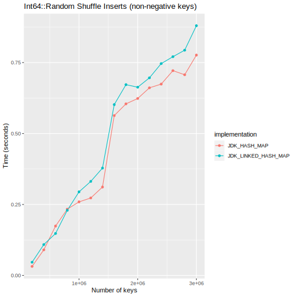

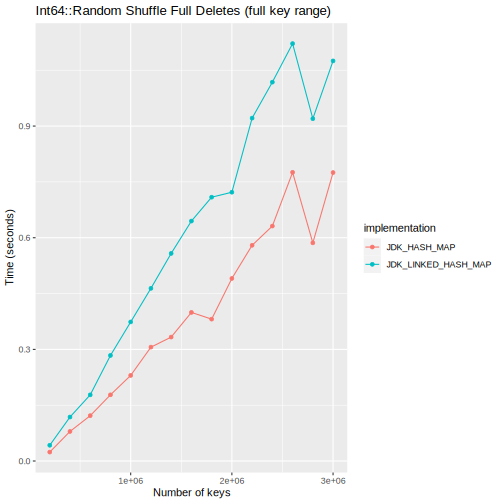

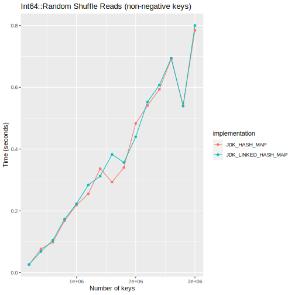

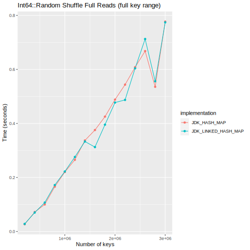

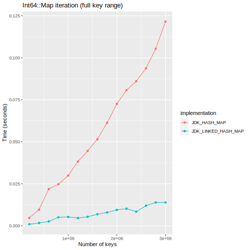

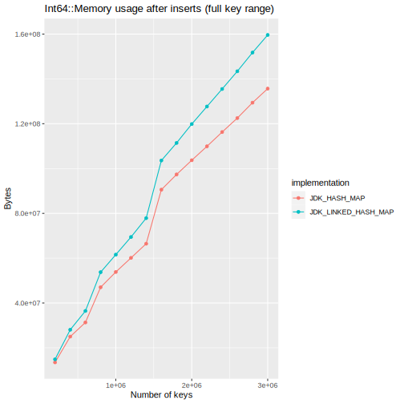

### Small String keys

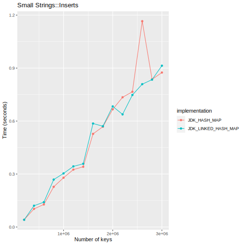

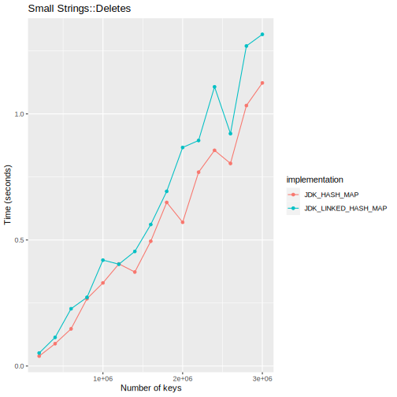

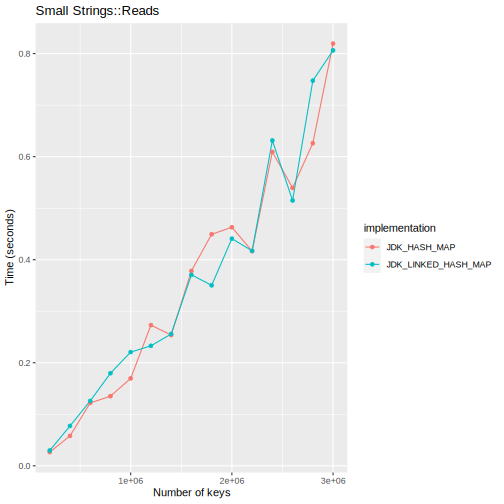

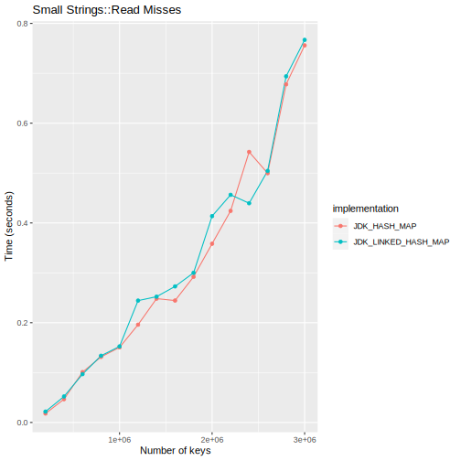

### Large String keys

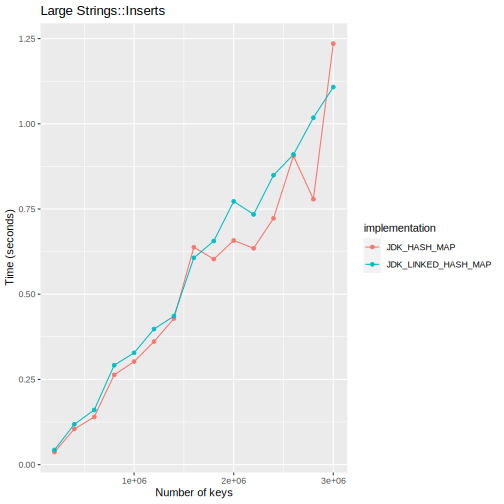

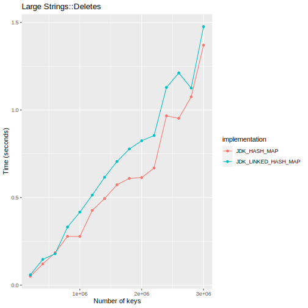

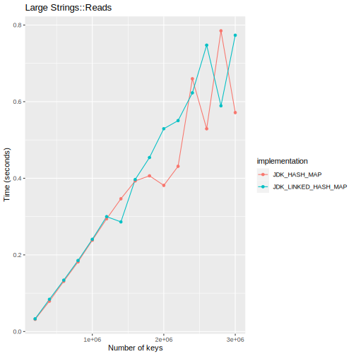

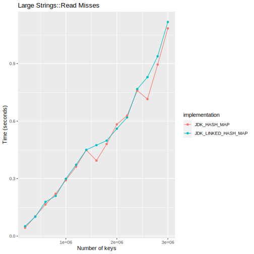

## License

   Copyright 2020 Carlos Macasaet

   Licensed under the Apache License, Version 2.0 (the "License");
   you may not use this file except in compliance with the License.
   You may obtain a copy of the License at

   https://www.apache.org/licenses/LICENSE-2.0

   Unless required by applicable law or agreed to in writing, software
   distributed under the License is distributed on an "AS IS" BASIS,
   WITHOUT WARRANTIES OR CONDITIONS OF ANY KIND, either express or implied.
   See the License for the specific language governing permissions and
   limitations under the License.
